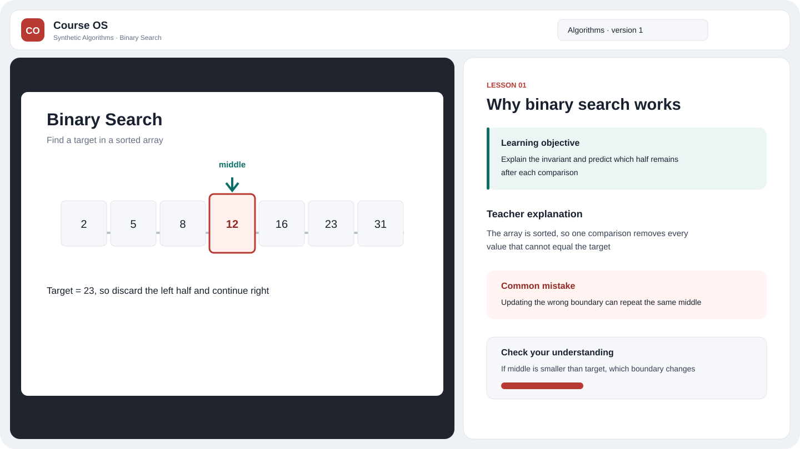

<h1 align="center">Course OS</h1>

Course OS compiles course material into verifiable explanations, formative assessment, and durable mastery records, then presents them in a visual-left, teaching-right player.

[中文](README.md) · [Architecture](docs/architecture.md) · [Local development](docs/runbooks/local-development.md) · [Deployment](docs/runbooks/deployment.md) · [Security](SECURITY.md)

Status: `2.4.0` controlled personal preview in its large-scale finishing phase. It is not a public multi-user product and is not presented as a complete production `1.0`.



This repository contains Apache-2.0 source code and synthetic test material only. Real course files, page images, learning records, databases, logs, host configuration, domains, and secrets are excluded from the public source tree.

## 1. 2.4 boundaries

- Immutable releases and `ReleaseManifest` objects pin source, page, explanation, assessment, writing-policy, model, quality, and cost versions.
- The formal course tree excludes synthetic, legacy, regression, other-workspace, and draft-source content.
- Pages, questions, mastery, review plans, and randomized assessment remain scoped to the workspace and pinned release.
- Mouse, touch, and keyboard course-tree interactions share one persistence model; page, zoom, pan, and release selection recover after reload.
- One teaching visual stays on the left; explanations, KaTeX, line-by-line pseudocode, questions, and assessment stay on the right.
- ReadWeave remains the semantic authority. Writes carry `Idempotency-Key`, `X-Actor`, `X-Workspace-Id`, `X-Request-Id`, and `X-Schema-Version`.
- ReadWeave failures become controlled browser errors without exposing tokens, raw upstream responses, or server details.

Private acceptance uses 25 Introduction v4 pages and 47 Chapter 2 v5 pages, 72 pages in total. Those materials and screenshots are not part of this repository.

## 2. Quick start

Node.js 24 and pnpm 10 are required.

```powershell
corepack enable
pnpm install --frozen-lockfile
pnpm seed:synthetic
pnpm --filter @course-os/api start
```

In another terminal:

```powershell
pnpm --filter @course-os/web dev
```

Open the local URL printed by Vite and select the synthetic course. This path needs no model key and reads no private course material.

## 3. Verification

```powershell
pnpm test
pnpm typecheck
pnpm build
pnpm verify:course
pnpm verify:tree
pnpm verify:routes
pnpm verify:writing
pnpm verify:public
```

`verify:writing` always validates the versioned policy manifest. It compares private policy-source hashes only when `HUMAN_READABLE_SKILL_DIR` is set, so public CI has no private absolute-path dependency.

## 4. ReadWeave promotion

`pnpm promote:readweave` is read-only by default. After reviewing its dry-run and verifying backups and rollback, an operator may explicitly run `pnpm promote:readweave -- --apply`. The tool creates missing releases or drafts only. Same-ID or same-page hash differences stop immediately; no delete or overwrite method is used.

## 5. Deployment model

The public tree provides parameterized Compose and Nginx templates. Real hostnames, callbacks, VPS paths, network names, environment files, and secrets remain on the runtime host. Each deployment builds immutable images from an exact public `main` commit:

- `course-os-runtime:2.4.0-<short-sha>`
- `course-os-converter:2.4.0-<short-sha>`

Deployment stops when free disk is below 40 GB, the publication gate is denied, ReadWeave authentication is unavailable, hashes conflict, backup or rollback cannot be verified, or health checks fail.

## 6. Non-goals

The 2.4 closeout does not add multi-agent classrooms, voice, generated teaching decks, a paper track, public multi-user operation, LMS integration, or new infrastructure.

## 7. License

Course OS source code is licensed under [Apache-2.0](LICENSE). ReadWeave runs as a separate service. Private course materials are not licensed by this repository.
