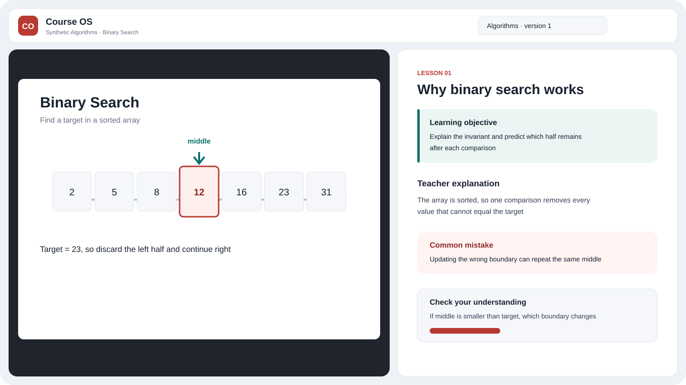

<h1 align="center">Course OS</h1>

把课件编译成可核验讲解、形成性测验和长期掌握记录，再通过左图右文播放器完成学习

[English](README.en.md) · [架构](docs/architecture.md) · [本地开发](docs/runbooks/local-development.md) · [部署](docs/runbooks/deployment.md) · [安全](SECURITY.md)

当前版本为 `2.4.0` 受控个人预览，处于大型收尾阶段，不是公开多用户产品，也不宣称完整生产 `1.0`



仓库只包含 Apache-2.0 源码和合成测试资料，真实课件、页面图片、学习记录、数据库、日志、主机配置、域名和秘密都不属于公开源码树

## 1. 2.4 能力边界

- 不可变课程 release 和 `ReleaseManifest` 固定来源、页面、讲解、测验、Writing Policy、模型、质量与成本版本
- 课程树按材料的当前版本指针展示内容；已确认的 `draft_source` 可以作为当前草稿入口，逐页提供已保存正文，未生成页面明确显示未生成，不会自动发布
- 历史版本保留在版本历史中；没有已生成正文的页面继续保持未就绪，不会因材料被选为当前版本而变成已发布
- 页面、问答、题库、掌握状态、复习计划与随机题受工作区和固定 release 约束
- 鼠标、触摸与键盘都可操作课程树，页码、缩放、平移与固定 release 可恢复
- 左侧同一时刻只显示一个教学视觉，右侧负责讲解、KaTeX、伪代码逐行说明、提问和测验
- ReadWeave 是语义权威，写入带 `Idempotency-Key`、`X-Actor`、`X-Workspace-Id`、`X-Request-Id` 与 `X-Schema-Version`
- ReadWeave 故障向浏览器返回受控错误，不下发 token、原始远端响应或服务器细节

教学质量提示词按用户要求冻结；本轮工程修复与脱敏发布已获授权，工程候选标签仅固定可继续开发的代码，不代表教学质量通过或已登录公网验收通过，具体提交、部署版本与验证范围分别记录，不以其中一项代替其他项

## 2. 快速开始

从干净检出开始，需要 Node.js 24 和 pnpm 10，安装使用锁文件固定依赖：

```powershell
corepack enable
pnpm install --frozen-lockfile
pnpm seed:synthetic
pnpm --filter @course-os/api start
```

另开终端

```powershell
pnpm --filter @course-os/web dev
```

浏览器打开终端显示的本地地址并选择合成课程，合成路径不需要模型密钥，也不会读取私有课件

## 3. 验证

```powershell
pnpm test
pnpm typecheck
pnpm build
pnpm verify:course
pnpm verify:tree
pnpm verify:routes
pnpm verify:writing
pnpm verify:public
```

`verify:writing` 始终核对版本化策略清单，只有设置 `HUMAN_READABLE_SKILL_DIR` 时，它才额外核对私有策略源文件哈希，公开 CI 不依赖任何本机绝对路径

## 4. ReadWeave 状态提升

运维脚本默认只读

```powershell
pnpm promote:readweave
```

只有人工复核 dry-run、验证备份与回滚点后，才可显式执行 `pnpm promote:readweave -- --apply`，脚本只创建缺失 release 或 draft，同 ID 或同页面不同哈希会立即停止，不删除、不覆盖远端草稿，也不允许用本地状态文件替换远端权威数据

## 5. 部署模型

公开仓库提供变量化 Compose 与 Nginx 模板，真实主机名、认证回调、VPS 路径、网络名、环境文件和秘密只保存在运行环境，每次部署都从公开 `main` 的精确提交构建以下不可变镜像

- `course-os-runtime:2.4.0-<short-sha>`
- `course-os-converter:2.4.0-<short-sha>`

部署前按本次构建、当前镜像和保留回滚镜像估算磁盘峰值；空间不足以完成本次操作时停止，不使用固定容量门槛，ReadWeave 写入仍由远端权威服务确认，临时来源中断时，已确认的本地阅读副本可在同步降级状态下只读；空副本不会就绪，来源明确拒绝认证时停止阅读

## 6. 非目标

2.4 收尾不扩展多 Agent 课堂、语音、自动教学 PPT、论文轨道、公开多用户、LMS 或新的基础设施

`engineering-baseline-candidate-20261002-r3` 保留为历史恢复点；当前代码与部署版本分别以提交和部署记录为准，教学质量迭代、写作策略修改及失败页批量再生成按用户要求暂停，等待新版写作规则，现有内容与失败证据保留；未生成不等于读取故障，旧版本的公网验证不能代签新候选：目录写入期间阅读、权威保存与恢复、原生缩放及 ReadWeave 编辑往返都须按同一候选复核，未完成时不标为工程日用基线，隔离工程回归不能替代公网流程，候选标签不表示教学质量通过

ETAPI 的目录元数据使用独立权威索引，普通重命名、移动和归档不再复制讲义正文；已有安装按部署说明进行一次受控激活及必要回滚，确认保存后增量更新阅读副本，安全相关变更仅保护受影响对象，ETAPI 普通删除可恢复，永久擦除需要 ReadWeave 原生登录界面；回收站依据实际适配器能力显示操作，不把索引移除当作永久删除

## 7. 许可

Course OS 源码使用 [Apache-2.0](LICENSE)，ReadWeave 作为独立服务运行，私有课程材料不受本仓库源码许可授权

### 导入进度与清理

上传按实际字节显示进度，上传结束后等待检查与接单；丢失响应时使用同一操作键恢复，不重新创建导入，转换阶段在取得页数后报告真实计数，总完成度只计成功交付页，失败页单独展示，普通草稿仅显示“草稿”，修订号保留在历史记录中

任务页分别展示上传、转换、资料保存、材料登记、识图、生成、正文保存和承接，阶段可以同时运行

- 页数确定后，图片渲染与文字提取并行，新自动导入使用不可变的本地来源输入，让识图和讲解与材料登记重叠，来源确认后才写入权威正文
- 识图费用写入与讲解生成重叠，付费结果先保存检查点，页面并行上限为 14
- 保存暂时失败时有限重试并复用原结果，权限与修订冲突暂停，不显示为已保存，后台检查点不代替 ReadWeave 权威确认
- 模拟测试不代表完整公网验收

普通目录按课程与材料导航，材料恢复上次阅读页；页码仍可在阅读器和搜索中定位，未选课程的导入进入工作区共用的“未分类”，PDF 导入先预览逐页识别的双拼方案，也可保留原页；歧义布局不静默裁切，拆分页使用独立来源区域和页标识，不迁移旧纸页的答案，转换镜像固定使用 pypdfium2 4.30.0，依赖说明见 THIRD_PARTY_NOTICES.md

任务结束后耗时固定在服务端记录的结束时间；历史记录没有可信结束时间时明确显示未记录，已保存但未发布的讲解提供阅读入口，不自动发布

“清除失败任务”持久清理终态通知，保留材料、费用、答案和原接单关联；正在运行或确认后改变的任务跳过，“清空回收站”要求确认对象及永久删除后果，并检查共享引用、学习记录与正在运行的工作；不具备安全远端删除能力的适配器明确跳过，不能把移除本地索引当作永久删除
