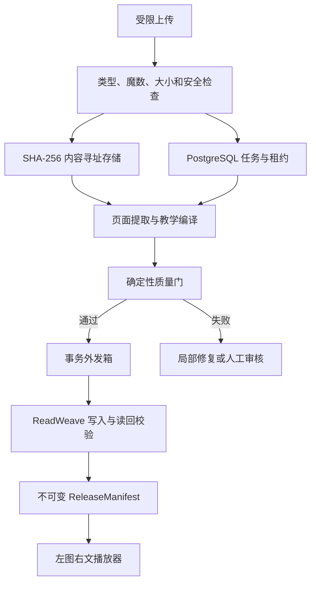

# Course OS 架构

## 1 核心决定

Course OS 负责任务与播放器，ReadWeave 负责正式课程语义，两者通过 `/api/course/v1` 通信

PostgreSQL 只保存运行状态，内容寻址存储只保存字节，浏览器只保存界面偏好和未提交输入

## 2 数据流

图 2.1　任务只有在 ReadWeave 写入并读回一致后，才能从 `pending_sync` 进入 `completed`

## 3 失败边界

- ReadWeave 不可用时，任务停在 `pending_sync`
- 数学解析失败、覆盖不足或来源冲突时，页面不能发布
- 相同问题自动修订 2 次仍失败时，停止模型调用并进入人工审核
- 模型提供商不可用时，已有正式发布仍能离线学习
- 浏览器刷新只恢复固定发布、当前页、锚点、缩放和平移，不改变课程内容

## 4 2.4 运行边界

本地开发使用文件适配器和合成资料；受控部署使用 ETAPI 适配器连接独立 ReadWeave 服务。两种模式实现相同的 Course OS 合同，不直接访问 ReadWeave 数据库。

正式树、页面、问答、掌握与复习读取都带工作区和固定 release 上下文。写入必须带幂等键、actor、工作区、请求 ID 与 `2.4.0` schema 版本。ReadWeave 不可用时，公开 API 只返回受控错误；已有不可变发布仍可回滚，未确认写入不得冒充成功。

公开源码树只包含变量化部署模板。真实域名、VPS 路径、认证回调、网络名称、秘密和私有课程内容属于运行环境配置。
