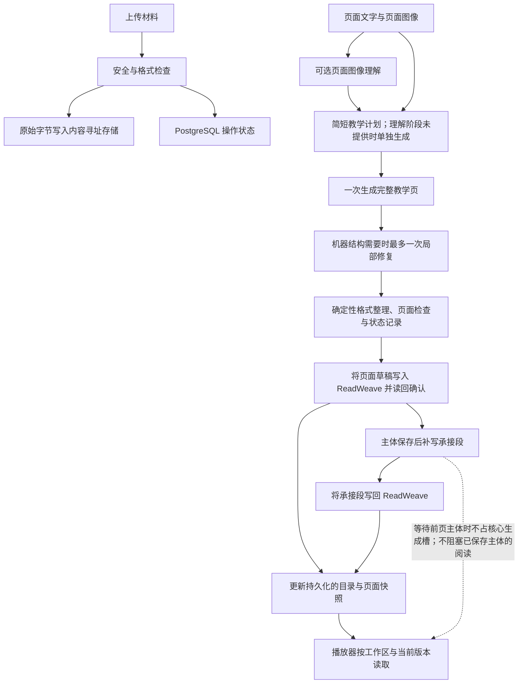

# Course OS 架构

## 1 核心边界

Course OS 负责材料导入、生成任务、运行状态和播放器。ReadWeave 是课程、版本、讲解及学习记录的语义权威；Course OS 不以 PostgreSQL 中的课程副本取代它。

原始上传字节放入内容寻址存储。PostgreSQL 只保存 Course OS 操作数据，例如导入与生成任务、计划、租约、事件、幂等记录和运行配置；课程语义数据不存入 PostgreSQL。

API 在操作员确认来源后，把指定工作区的课程目录、版本索引和已确认页面快照持久化到本地阅读副本。页面快照按来源身份、工作区、release 和页面隔离，供播放器读取；副本是 ReadWeave 的确认投影，不是另一份权威数据源。

## 2 单页生成与读取

```mermaid
flowchart TD
    Upload[上传材料] --> Inspect[安全与格式检查]
    Inspect --> Bytes[原始字节写入内容寻址存储]
    Inspect --> Ops[PostgreSQL 操作状态]

    Source[页面文字与页面图像] --> Understand[可选页面图像理解]
    Understand --> Plan[简短教学计划；理解阶段未提供时单独生成]
    Source --> Plan
    Plan --> Main[一次生成完整教学页]
    Main --> Repair[机器结构需要时最多一次局部修复]
    Repair --> Format[确定性格式整理、页面检查与状态记录]
    Format --> Save[将页面草稿写入 ReadWeave 并读回确认]
    Save --> Replica[更新持久化的目录与页面快照]
    Replica --> Player[播放器按工作区与当前版本读取]

    Save --> Bridge[主体保存后补写承接段]
    Bridge --> BridgeSave[将承接段写回 ReadWeave]
    BridgeSave --> Replica
    Bridge -. 等待前页主体时不占核心生成槽；不阻塞已保存主体的阅读 .-> Player
```

页面检查记录草稿是否可读、是否可发布及质量问题；可读草稿不因此自动成为正式发布。材料当前版本可指向 `draft_source`，前提是每页都有对应的已确认草稿，状态为 `ready` 或 `clean` 且正文完整。该材料仍标记为草稿/待审核，发布仍是独立操作。未生成页面继续保持未就绪，历史版本留在版本历史中。

承接段在主体保存后单独补写。工作器可以等待前一页主体并补上承接段，但这个等待不占核心生成槽，也不阻止播放器读取已经保存的主体。承接段失败时保留主体，任务可以只恢复缺失的承接段。

## 3 阅读就绪与降级

`/healthz` 只报告 API 进程是否存活。`/readyz` 报告是否有可用的已确认阅读目录和页面副本；空安装可以健康但尚未阅读就绪。操作员通过 `scripts/materialize-reading.ts` 确认已有权威数据，这不是启动时生成内容的任务。

ReadWeave 暂时不可用时，已确认副本继续提供只读课程内容并报告同步降级；写入仍需 ReadWeave 确认。来源明确返回 401/403 时，阅读访问被停止，直到权限恢复并重新确认。

## 4 持久化与版本范围

本地开发可使用文件适配器与合成资料；受控部署通过 ETAPI 访问独立 ReadWeave 服务，不直接访问其数据库。PostgreSQL 承载操作数据，内容寻址存储承载原始上传，ReadWeave 承载课程语义；本地已确认副本只保存受来源身份、工作区、release 和页面范围约束的课程目录、版本索引与页面读取快照。问答和学习状态继续由 ReadWeave 提供权威数据。

课程、页面、问答、掌握记录和复习状态按工作区及选定版本读取。页面写入使用幂等键、actor、工作区、请求 ID 和 schema 版本；只有权威写入被确认并读回后，才能报告写入成功。

浏览器保留界面偏好与未提交输入。真实部署地址、认证回调、秘密和私有课程材料由运行环境管理，不写入公开源码。
