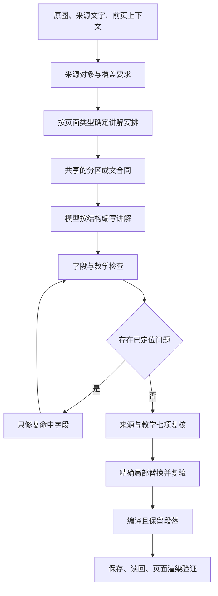

# 教学质量修复与验证方案

## 1. 已证实的问题

本轮基于代码基线 `3ebc0d7` 与远端草稿读回调查，原始课程及运行证据保存在私有运行目录

| 用户体验 | 已证实的原因 | 修复与证据 |
|---|---|---|
| 随机题显示原始公式 | 题干和选项用 React 普通文本输出，没有经过 Markdown 数学渲染 | 统一题干、选项、反馈的渲染组件，验证实际 HTML 中的 KaTeX 节点 |
| 保存后内容重新挤在一起 | 页面编译器的 `oneSentence` 抹去换行 | 编译保留 Markdown，保存读回测试比较段落和列表 |
| 单个英文词混入正文 | 英文检查器只抓部分大写缩写和多词短语 | 加入单词坏例与正确配对反例，继续保护数学、代码与原始标签 |
| 易错点挤成一长句 | 专用提示词要求四种独立作用用分号连接 | 四种作用各成段，确定性排版只识别明确标签，不猜测任意冒号 |
| 表格无法成为真正表格 | 渲染组件没有启用 Markdown 表格语法 | 增加表格解析与局部横向滚动，原行列和值不改 |
| 覆盖证据虚高 | 声称要求 12 字原文摘录，代码只找任意 5 字重合 | 要求完整证据片段存在且至少 12 字；片段存在仍不能证明语义覆盖 |
| 删除内容后看似通过 | 错误承接段被直接删除，总结超长被截断 | 保留内容进入修复，不能以信息丢失换取通过 |
| 换供应商后修复费用增加 | OpenCode Chat 协议不支持原来的字段修复路径，会重写整页 | 协议适配器直接请求指定字段，再与原对象合并 |
| 事实复核通过却仍不可读 | 复核提示词明确只核对事实，且不能修复承接、先验知识、目标 | 扩展定位范围，分别记录七项教学复核结果 |

提示词长度可能增加遗漏风险，但目前没有对照实验能够证明它是主因，不能把这一推测写成已经确定的故障原因

## 2. 生成和保存路线

每页使用固定写作策略与生成配置，保留当前 API 兼容字段

共享合同放在 `packages/quality/src/presentation.ts`，进入生成提示词，同时用于机械检查和易错点排版

模型先按独立对象和理解依赖组织内容；机械排版只处理已经明确表达的结构，不用正则表达式猜测事实、翻译名称或补齐缺失知识

七项教学复核分别检查入口、术语、前提、结构、对象、推理、题目，每项必须记录正文证据和判定；它们与来源真实性分别检查，任何一项缺失不得宣称七项全通过

## 3. 借鉴依据与边界

ReadWeave 写作运行时提供了来源单元、段落合同、覆盖矩阵、受约束成文和精确修复思路，本轮采用其可追溯分配和局部提交原则

当前安装的写作 Skill 是实际表达依据，历史运行时对术语词源、三轮阻断等要求不自动覆盖最新版 Skill

[OpenMAIC](https://github.com/THU-MAIC/OpenMAIC) 可作为教学生成与运行分离的比较对象，本轮不移植其多角色课堂，也不把该项目的存在当成本项目质量已经得到证明

[新南威尔士州教育部门的认知负荷实践指南](https://education.nsw.gov.au/about-us/education-data-and-research/cese/publications/practical-guides-for-educators/cognitive-load-theory-in-practice.html) 与[美国教育科学研究院学习指南](https://ies.ed.gov/ncee/wwc/PracticeGuide/1) 是当前 Skill 提供的教学设计依据，支持明确示范、把相关信息放在一起、连接具体和抽象表示；这些依据不证明某个模型或本次实现一定有效，效果仍需实测

## 4. 模型与费用

优先使用 OpenCode 的 DeepSeek Flash；读取原图的阶段选择已验证能接收图像的 Flash 变体

模型目录、协议及价格以[供应商当前文档](https://opencode.ai/docs/go/)和实际请求为准，不凭名称猜测视觉能力

每页分别记录模型、输入输出用量、订阅额度折算消耗、实际现金费用、重试消耗和总耗时；订阅现金边际费用为零不等于没有消耗额度

单页既有预算上限继续覆盖生成与修复，不通过增加无上限全文重试来追求评分；人民币目标需按实际结算或有日期的汇率换算，不虚报换算结果

## 5. 验证方法

1. 固定失败样本
   - 保存真实旧草稿及代码版本
   - 用合成最小对照样本覆盖未译英文、定义例外、独立问题、四段易错点和题目公式
   - 错例必须被拒绝，正确定义、代码、公式和原始表格不得因格式检查被误改
2. 检查数据经过每一层后的结果
   - 模型返回内容、编译内容、保存读回内容保持段落和公式一致
   - 所有题目选项都参与数学检查
   - 渲染后的 HTML 必须出现对应公式节点和真实表格单元格
3. 多页实测
   - 选择表格比较、公式推导、概念机制与流程图，避免围绕某一个页码写规则
   - 固定来源、语言、策略、预算与模型，记录每页独立结果
   - 先运行机械检查和七项复核，再由执行 Agent 对照原图逐页阅读
4. 判断是否改善
   - 回归测试全通过只是代码正确性的证据
   - 语义评分不代替阅读证据，也不宣称已经完成形式化数学证明
   - 任何未生成、失败或尚未阅读的样本均记为未通过，不能用平均分掩盖
   - 真实网站打开新样本时核对版本、页码与更新时间，避免一直阅读旧正式版本

## 6. 收敛标准

- 已登记机械坏例全部被拒绝，配对正确例全部通过
- 题干、选项、答案及解析中的每条公式均经过解析与渲染测试
- 编译和保存不抹去换行，不截断内容，不删除失败章节
- 七项教学复核完整且全部有证据，局部替换不改变其他字段
- 多种页面真实生成成功并完成原图对照阅读，费用与失败重试可追踪
- 远端健康、数据同步、认证和页面访问通过，源码提交与运行镜像可对应

在上述证据齐全前，只报告实际完成的项目，不宣布根治全部质量问题或绝对稳定
