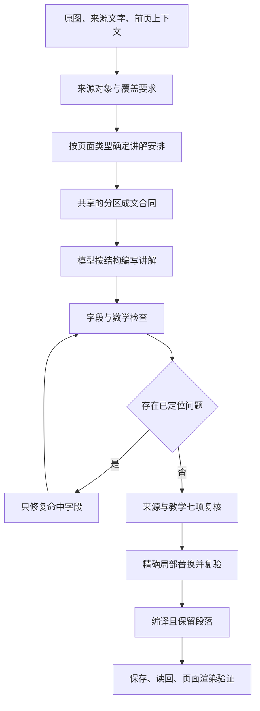

# 教学质量修复与验证方案

## 1. 已证实的问题

本轮基于代码基线 `3ebc0d7` 与远端草稿读回调查，原始课程及运行证据保存在私有运行目录

| 用户体验 | 已证实的原因 | 修复与证据 |
|---|---|---|
| 随机题显示原始公式 | 题干和选项用 React 普通文本输出，没有经过 Markdown 数学渲染 | 统一题干、选项、反馈的渲染组件，验证实际 HTML 中的 KaTeX 节点 |
| 保存后内容重新挤在一起 | 页面编译器的 `oneSentence` 抹去换行 | 编译保留 Markdown，保存读回测试比较段落和列表 |
| 单个英文词混入正文 | 英文检查器只抓部分大写缩写和多词短语 | 加入单词坏例与正确配对反例，继续保护数学、代码与原始标签 |
| 易错点挤成一长句 | 专用提示词要求四种独立作用用分号连接 | 四种作用各成段，确定性排版只识别明确标签，不猜测任意冒号 |
| 表格无法成为真正表格 | 渲染组件没有启用 Markdown 表格语法 | 增加表格解析与局部横向滚动，原行列和值不改 |
| 覆盖证据虚高 | 声称要求 12 字原文摘录，代码只找任意 5 字重合 | 要求完整证据片段存在且至少 12 字；片段存在仍不能证明语义覆盖 |
| 删除内容后看似通过 | 错误承接段被直接删除，总结超长被截断 | 保留内容进入修复，不能以信息丢失换取通过 |
| 换供应商后修复费用增加 | OpenCode Chat 协议不支持原来的字段修复路径，会重写整页 | 协议适配器直接请求指定字段，再与原对象合并 |
| 事实复核通过却仍不可读 | 复核提示词明确只核对事实，且不能修复承接、先验知识、目标 | 扩展定位范围，分别记录七项教学复核结果 |

提示词长度可能增加遗漏风险，但目前没有对照实验能够证明它是主因，不能把这一推测写成已经确定的故障原因

## 2. 生成和保存路线

每页使用固定写作策略与生成配置，保留当前 API 兼容字段

共享合同放在 `packages/quality/src/presentation.ts`，进入生成提示词，同时用于机械检查和易错点排版

模型先按独立对象和理解依赖组织内容；机械排版只处理已经明确表达的结构，不用正则表达式猜测事实、翻译名称或补齐缺失知识

七项教学复核分别检查入口、术语、前提、结构、对象、推理、题目，每项必须记录正文证据和判定；它们与来源真实性分别检查，任何一项缺失不得宣称七项全通过

## 3. 借鉴依据与边界

ReadWeave 写作运行时提供了来源单元、段落合同、覆盖矩阵、受约束成文和精确修复思路，本轮采用其可追溯分配和局部提交原则

当前安装的写作 Skill 是实际表达依据，历史运行时对术语词源、三轮阻断等要求不自动覆盖最新版 Skill

[OpenMAIC](https://github.com/THU-MAIC/OpenMAIC) 可作为教学生成与运行分离的比较对象，本轮不移植其多角色课堂，也不把该项目的存在当成本项目质量已经得到证明

[新南威尔士州教育部门的认知负荷实践指南](https://education.nsw.gov.au/about-us/education-data-and-research/cese/publications/practical-guides-for-educators/cognitive-load-theory-in-practice.html) 与[美国教育科学研究院学习指南](https://ies.ed.gov/ncee/wwc/PracticeGuide/1) 是当前 Skill 提供的教学设计依据，支持明确示范、把相关信息放在一起、连接具体和抽象表示；这些依据不证明某个模型或本次实现一定有效，效果仍需实测

## 4. 模型与费用

优先使用 OpenCode 的 DeepSeek Flash；读取原图的阶段选择已验证能接收图像的 Flash 变体

模型目录、协议及价格以[供应商当前文档](https://opencode.ai/docs/go/)和实际请求为准，不凭名称猜测视觉能力

每页分别记录模型、输入输出用量、订阅额度折算消耗、实际现金费用、重试消耗和总耗时；订阅现金边际费用为零不等于没有消耗额度

单页既有预算上限继续覆盖生成与修复，不通过增加无上限全文重试来追求评分；人民币目标需按实际结算或有日期的汇率换算，不虚报换算结果

## 5. 验证方法

1. 固定失败样本
   - 保存真实旧草稿及代码版本
   - 用合成最小对照样本覆盖未译英文、定义例外、独立问题、四段易错点和题目公式
   - 错例必须被拒绝，正确定义、代码、公式和原始表格不得因格式检查被误改
2. 检查数据经过每一层后的结果
   - 模型返回内容、编译内容、保存读回内容保持段落和公式一致
   - 所有题目选项都参与数学检查
   - 渲染后的 HTML 必须出现对应公式节点和真实表格单元格
3. 多页实测
   - 选择表格比较、公式推导、概念机制与流程图，避免围绕某一个页码写规则
   - 固定来源、语言、策略、预算与模型，记录每页独立结果
   - 先运行机械检查和七项复核，再由执行 Agent 对照原图逐页阅读
4. 判断是否改善
   - 回归测试全通过只是代码正确性的证据
   - 语义评分不代替阅读证据，也不宣称已经完成形式化数学证明
   - 任何未生成、失败或尚未阅读的样本均记为未通过，不能用平均分掩盖
   - 真实网站打开新样本时核对版本、页码与更新时间，避免一直阅读旧正式版本

## 6. 收敛标准

- 已登记机械坏例全部被拒绝，配对正确例全部通过
- 题干、选项、答案及解析中的每条公式均经过解析与渲染测试
- 编译和保存不抹去换行，不截断内容，不删除失败章节
- 七项教学复核完整且全部有证据，局部替换不改变其他字段
- 多种页面真实生成成功并完成原图对照阅读，费用与失败重试可追踪
- 远端健康、数据同步、认证和页面访问通过，源码提交与运行镜像可对应

在上述证据齐全前，只报告实际完成的项目，不宣布根治全部质量问题或绝对稳定

## 7. 首轮远端实测揭示的问题

`26f98f5` 已通过 248 项测试并上线，但首张真实页面经过备用路由后由官方 DeepSeek 返回，因此不能算作 OpenCode 样本成功

已取消该计划并保留事件，原有页面不以失败结果覆盖

- OpenCode Flash 的简单直接请求成功，约 1.9 秒返回；这只能证明基本凭据和文本请求可用，不能证明完整视觉生成质量
- 旧路由在内容错误或超时后也可能切换付费供应商，未留下充分的切换原因；后续收窄为额度或限流条件，其他失败保留原始供应商
- OpenCode 的 DeepSeek Chat 请求改为显式关闭隐藏推理，最终输出继续保留质量模式的正文预算；教学步骤仍须在可读正文里完整写出
- 字段修复提示中的旧分号排版要求同步移除，避免生成与修复阶段互相矛盾
- 第二次来源修复后的接受判断同时检查教学复核，不能只因来源核对通过而忽略表达问题

上述调整仍需新的真实多页生成结果验证，不因直接连接成功或单元测试通过就宣称质量改善成立

## 8. 分字段修复与正文片段绑定

第二轮四页均未通过，保留失败状态，不计为交付完成

独立对照中，同时重写多个字段后，模型仍会拼接不存在于正文的覆盖摘录；将正文定稿与摘录分开后，该类定位错误消失

当前实现调整为：

1. 每次只修复一个内容字段，传入该字段的成文规则，保留其他字段
2. 先完成正文、定义、题目等内容，再建立覆盖证据
3. 程序从定稿正文提取候选片段，模型只选择片段编号，程序绑定实际文字；不存在的编号拒绝，不用模糊相似度代替真实摘录
4. 修复费用逐次累计，后续请求使用剩余预算；会话编号在同一页面任务内保持稳定，请求幂等键仍各自独立
5. 原文引句可能以数字开头，带中文解释的真实引句不应因这个形式差异误判；普通英文和题库选项仍参与检查

片段能够定位只证明文字存在，不证明它解释了对应来源对象，因此来源复核和逐页原图对照仍须分别进行

## 9. 复核上下文与误判修复

第三轮首张页面的机械检查已通过，但语义复核失败，实际估算消耗为 0.038797 美元；后续批次已取消，不能算作成功生成

查到的具体差异如下：

- 生成请求有前页上下文，复核请求漏传了该字段，导致承接段被误判为无来源
- 复核器没有收到实际写作规则与共享成文合同，无法一致地区分首次专业定义与后续中文表达；首次专业定义仍应按规则配英文，不能把全部双语问题当作误报
- 必要通用定义被当作课件原文主张核对，复核修正可能把有用解释删成“页面未提供”
- 原图中的可计算等式以及定义的物理量仍可能被漏检，机械检查不能替代实际核算

修复将前页来源、实际写作规则和成文合同传入同一复核请求，明确区分原图事实、前页事实、通用背景、可验证推导与自拟例子；通过具体定义、单位、运算与成立条件判断，不能只根据是否逐字出现在原图里决定对错

回归测试直接检查供应商收到的请求，防止仅在计划中声明“已传上下文”而实现仍然遗漏；真实同页复核还必须验证误判减少且能够指出原先漏掉的事实错误

## 10. 分开核验事实与教学表达

同稿对照发现，把来源、计算、定义、全部写作规则和七项教学复核塞入一次请求，会遗漏实际数值错误。单独事实核验约 9.8 秒返回，输入约 6961 token，能够发现原先漏掉的阶乘等式错误；该样本仍漏检了一个定义问题，不能把一次改善当作全量证明

高、低强度思考实验分别耗尽两次 8000 与 12000 token 输出额度，未得到可用核验结果；这些试验不作为默认配置上线，费用计入研发试验

当前流水线把事实核验与教学表达核验分别调用，仍使用同一 OpenCode Flash 路由并累计同一页预算：

- `source-audit-prompt.md` 只核对来源、定义、数值、条件及跨字段一致性
- `teaching-audit-prompt.md` 结合实际写作规则，核对入口、定义表达、段落、对象解释、推导可读性及题目
- 一个核验通过不能覆盖另一个核验的失败，分别保留证据
- 补丁字段限定为本页真实存在的路径，不接受模型自造字段
- 正文中的精确事实片段被修改时，包含同一片段的覆盖摘录在同一事务中同步替换；不把无关摘录改绑到整段正文

上述改变仍以真实四类页面生成、原图对照及页面渲染作为验收，不能只依赖模型自评

## 11. 修复事务顺序与费用记录

分开核验后仍发现两个执行缺口：写作核验看到的还是事实修正前的稿子，可能提出互相冲突的补丁；后续请求失败时，成本记录遗漏了此前成功的调用。第四轮四页均失败，不能只凭日志中较低的失败费用宣称预算达标

当前修复采用以下顺序：

1. 核验事实并执行可精确定位的最小补丁
2. 写作核验读取事实修正后的内容
3. 合并补丁后重新检查内容与覆盖引用
4. 每次模型调用独立保留用量回执，后续失败或用户取消不会抹去已发生的用量
5. 取消只阻止草稿写入和任务继续运行，已经收到的计费回执仍需幂等记账；网络中断且未收到用量的请求仍无法凭空补齐账单

OpenCode 的当前文档区分工作日 UTC 01–04、06–10 高峰时段与其他非高峰时段。价格估算按该时间表选择，并在快照 ID 中记录价格时段；显式自定义价目表不自动折扣。价格窗口边界与周末均使用固定时间测试，不能长期拿高峰价当当前实际估算，也不能在进入高峰后继续沿用低价

单页上限仍为 0.06 美元，不增加预算换取通过；订阅额度估算与实际现金费用继续分开记录。已取消旧试验的缺失用量不伪造补写，保留对账缺口

## 12. 校准复核结论与实际正文的关系

第五轮四页仍未通过，估算费用依次为 0.042128、0.018147、0.022406、0.019762 美元，未发布这些失败稿

读取完整草稿与事件后发现，复核器把易错点中用于反驳的观点当作作者结论，也把选择题干扰项当作知识错误；部分“字段被截断”的判断与保存的完整字符串不符。这类复核错误会驱动后续修复改动原来正确的内容

本轮增加以下约束：

1. 每条事实复核必须绑定真实字段与其中的连续原文，不存在的引句作为复核错误处理，不能算成课程内容错误
2. 易错点结合错误观点、错因与正确判断整项核对，选择题结合题干、选项、正确答案与解析核对
3. 原样保留的错误公式结合其后独立核算与限制说明核对，不能孤立截取等式判定
4. 局部补丁在进入后续处理前，先验证原文确实存在；失败保留费用与错误，不修改稿件

同稿事实复核对照约 10.7 秒返回，输入 8758 token、输出 2156 token，原先两项易错点误判与干扰项误判未再出现。但其数值修正仍使用不够准确的数量级近似，因此这次对照只证明定位和上下文判断有所改善，不证明补丁已经正确或整个框架达到交付标准

移动端实测还发现，390 像素视口中学习网格内部被内容撑到约 613 像素，外层裁切掩盖了问题。修复把网格列限制到可用宽度，标题与工具栏按需换行；验证时同时测量内部区域和按钮位置，不只检查页面是否出现横向滚动条

## 13. 让局部修复收到实际问题位置

同轮另一张页面已经写明“只有在权重为正且其他项不变时”才成立的变化方向，却仍被条件检查器拒绝。原因是检查器只识别部分条件句式，没有识别“只有在”；易错点中的被反驳观点也可能被它单独检查

修复保留实际错误的检查，同时接受这些等价条件句式，并区分被反驳观点与正确判断。正反例验证既要求正确条件句通过，也要求错误的“正确判断”继续被检出

局部修复请求增加真实字段、问题原句和中文修改要求。重复标题指出全部重复位置，并要求按实际公式或对象区分标题；未翻译英文逐行定位到易错点、题干、选项、标准答案或解析，不能只给正文检查而漏掉题库。代码与数学符号不作为普通英文处理

这些改变减少的是误判与无效修复，仍需重新生成及逐页阅读才能判断成文质量；不会把既有失败记录改写成成功

## 14. 修复审计版本错位与无效页码说明

`15b1890` 的四页候选试生成仍全部失败，费用依次为 0.020755、0.033423、0.015104、0.021746 美元，未发布这些草稿

事件与草稿对照确认了三个执行缺口：

1. 写作审计给出补丁后，任务仍使用修复前的 teachingChecks 判定修复后的内容，形成必然失败的旧结论
2. 路由层先在一个内容版本上核验补丁，调用层随后在另一个版本上重新播放多条补丁；同一字段的修复发生重叠时会失去精确位置
3. 页码说明已被机械规则识别，但连续两次模型修复仍保留原句，说明确定性可删除的界面旁白不应交给模型反复决定

当前改为：

- 路由层在被审计的精确版本上执行最小补丁，并把修复后的完整 TeachingPackage 交给调用层
- 只有补丁存在时才单独复核修复后的教学表达；修复前的 verdict 只作为历史证据，不再直接判定新版本
- 补丁位置无效时在剩余单页预算内进行一次精确重试，仍无效则失败，不放宽事实检查
- sourceChecks 的 quote 只允许 Markdown、引号和空白等表示差异，不能用语义相近的改写冒充原文定位
- 页码、页脚和版式说明在内容规范化阶段确定性删除，保留前后真实教学段落

这批修复已有回归测试，但真实多页生成和浏览器阅读尚未完成，因此本节不把框架记为通过

## 15. 负面教学结论也必须绑定正文

`5f2d1c5` 上线后的候选实测中，第 7 页通过并保存为 ready，估算费用 0.013026 美元；第 4 页失败，估算费用 0.034567 美元；发现评估问题后取消后续批次，第 12 页在取消生效前已发生 0.016613 美元估算用量，第 16 页没有启动

第 4 页保存的完整讲解只有一段表格阅读说明，教学审计却声称该段连续重复两次。该结论没有绑定字段和原文位置，无法由实际草稿复现，属于评估误判

当前规则扩展为：

- teachingChecks 的 contradicted 与 unverified 必须提供实际 field 和该字段中的连续 quote
- 程序核对 quote 确实存在后才接受负面判定；只允许 Markdown、引号与空白的表示差异，不接受改写
- 无法定位的负面结论在单页预算内重试一次，仍无法定位则记为审计输出无效，不能驱动正文修复
- supported 仍须提供具体 evidence，但不强制用一个短引句冒充整个项目已经被证明

这项约束只消除无法定位的误判，不替代原图事实核对，也不把第 7 页一次成功外推为全量课程已经达标

## 16. 把机械通过后的人工失败变成回归规则

`9f81c9a` 上线后，第 4 页候选任务完成并保存为 ready，估算费用为 0.051644 美元；来源核验、教学核验、数学、结构与 ReadWeave 读回均通过，但逐段阅读仍发现三个系统性缺口，因此该结果不作为最终质量样例

- 正文把“多个目标相互竞争”扩大成“没有唯一最优解”，也用“每一代为什么不够用”概括方法演进；现有证据只能支持需要权衡及材料列出的局限，不能支持这些绝对结论
- `功耗（power）`、`时序（timing）` 等小写英文括注被旧英文检查器当成合格双语，实际不符合正式英文名称与后续优先使用中文的规则
- 完整讲解反复用“页面给出”“本页列出”“表中写着”组织段落，虽然没有逐字重复，仍让正文读起来像来源审计记录

当前改为：

1. 中文括号中的英文只有在按正式名称大小写书写时才算完成配对，小写词典式注释继续作为未配对英文处理
2. 完整讲解中过量来源旁白触发独立失败码，修复只改变叙述视角，不删除对象、数字、公式、条件与必要边界
3. “不存在唯一最优解”“每一种方法都不够用”等绝对结论触发论证强度检查；多个竞争目标只允许推出需要权衡，除非材料另有目标函数、权重、约束或比较证据
4. 来源核验与教学核验同时检查结论强度；修复字段精确定位到实际正文，并同步维护覆盖摘录
5. 写作策略重新核对公开仓库 `main@43133c20eabd0edde5ff8effa8d8a51c7ee8afa3`，当前快照恢复为 `writing-policy:1596555b73a37e62`，不再把 9 月 13 日的本地安装改版宣称为公开最新版

这些规则必须在表格页、公式页、概念页和流程页的多页试生成中共同通过，并由执行 Agent 阅读实际成稿后才能进入正式发布

## 17. 第一次最新版策略多页试验

`5ac412d` 与 Harness 2.4.37 上线后，以同一策略、模型和单页 0.06 美元上限生成第 4、7、12、16 页

- 第 4 页因来源旁白过多失败，费用 0.021587 美元；两轮修复都收到失败码，却没有收到命中的六行正文，因此无法可靠收敛
- 第 7 页被系统保存为 ready，费用 0.013032 美元；人工复读发现学习目标声称另一参数不变，而正文正确算出两个参数同时变化，同时承上启下内容在完整讲解开头重复，证明原有完成状态仍然漏检跨字段矛盾与跨区块重复
- 第 12 页因题目中的带权趋势缺少权重符号及其他输入固定条件失败，费用 0.013086 美元；两轮修复没有收到具体题号和原句，未能收敛
- 第 16 页在新缺口确认后取消，费用为 0；计划总费用 0.047705 美元，正式 release 未修改

当前执行修正包括：

1. 来源旁白失败向修复器提供每一条实际命中行，并要求全字段最多保留五条必要来源说明
2. 带权趋势失败定位到具体题号与解析原句，题干、答案和解析同步补齐权重符号及其他输入固定条件
3. 学习目标新增“另一参数保持不变”与正文“多个参数同时改变”的跨字段矛盾检查
4. 承上启下非空时，完整讲解开头再次复述前页触发失败；“页面上的对象”等审计式标题单独触发失败
5. 后续多页试验必须使用新的 Harness 2.4.38，不能把本轮第 7 页的旧 ready 状态混入新计划

## 18. 第二次最新版策略多页试验

`f26f20f` 与 Harness 2.4.38 上线后，新建候选 `material-version-e006f8aa-quality-v238-candidate`，继续生成第 4、7、12、16 页。计划 `ea0b88b1-b602-4bd3-8e14-68cc7ff8c86b` 固定使用 `writing-policy:1596555b73a37e62` 和 OpenCode Go 的 `deepseek-v4-flash-vision-exp`，未启用备用模型

- 第 4 页因总结包含六条而失败，费用 0.013086 美元；两轮模型修复都未把总结收敛到两至五条，人工核读还发现正文把并列表格擅自串成后一种方法逐代解决前一种方法
- 第 7 页因一个先验知识分句过短而失败，费用 0.013517 美元；人工核读同时发现完整讲解用“前页”再次复述已有承上启下，旧规则只识别“上一页”和“前一页”
- 第 12 页因带符号权重的趋势结论缺少权重为正及其他输入不变条件而失败，费用 0.025107 美元；先验知识还出现 `Reinforcement Learning “Agent”` 这种嵌套引号的异常术语配对
- 第 16 页因未翻译的 `designs` 失败，费用 0.037029 美元；正文还存在四处以上以来源为主语的旁白
- 四页均未保存为 ready，计划总费用 0.088739 美元，平均每页 0.022185 美元，正式 release 未修改

本轮把共因改为可验证的三层处理：

1. 总结的标题、列表前缀和超过五条的尾项合并属于无损结构变换，由编译器一次完成，不再消耗两轮模型调用；合并保留全部原句，不改写事实
2. 先验知识、带权趋势、方法演进和异常术语分别把具体字段与原句交给局部修复器，不再只传内部错误码
3. “前页”纳入承上启下重复检查；来源旁白从六行阈值收紧为四行；年代顺序不得被改写成逐代解决关系
4. 未加引号的 `10K designs` 在学习正文中确定性规范为 `10K 个设计样本`，引号内真实来源标签保持原样
5. Harness 升级到 2.4.39；旧候选继续保留为失败证据，后续试验必须建立新的候选和计划，不复用失败稿

## 19. 第三次最新版策略多页试验

`55cd230` 与 Harness 2.4.39 上线后，新建候选 `material-version-e006f8aa-quality-v239-candidate`，计划 `ef4fb3c9-8987-4290-a3b9-b3659fd0dc81` 继续使用同一写作策略和 OpenCode Go 的 `deepseek-v4-flash-vision-exp`，没有启用备用模型

- 第 4 页返回无效 JSON，任务 `30a76111-4d71-4874-a791-7a71f887349f` 失败，费用 0.009537 美元；这是本轮一次供应商输出错误，未产生可读成稿
- 第 7 页任务 `aa5ef855-301d-47c3-a0be-8c1ac2bbe4fa` 被机器判为完成，费用 0.013633 美元；人工核读发现学习目标把“动作空间有两个动作、每个回合执行其中一个”错写成“只有一个动作”，正文自身却保留了正确事实
- 第 12 页任务 `cac8d3cc-9819-4144-89e8-cf98d51aeaaa` 因语义审计输出无效而失败，费用 0.020382 美元；审计的 claim 使用 `$r_T=-\lambda Wirelength-\alpha congestion-\gamma density$`，evidence 却说明原图为 `$r_T=-Wirelength-\lambda congestion-\gamma density$`，仍错误返回 supported
- 第 16 页任务 `aaf4a9da-fd3f-4288-b7c7-76f6844fecb8` 因完整讲解重复承上启下而失败，费用 0.018458 美元；修复器此前只收到错误码，没有收到包含“上一页”的精确原句
- 计划总费用 0.062010 美元；正式 release 未修改

本轮修正继续针对共因：

1. 区分动作集合大小和单次执行数量；同页已经说明两个可选动作时，任何字段无条件声称“只有一个动作”都会按字段失败并定点修复
2. supported 来源审计若在 claim 与 evidence 中给出同一左端的不同公式，程序直接拒绝该审计，不能再由模型自称一致
3. 承上启下重复向修复器提供开头 700 字符内的实际命中行，只删除前页回顾并保留当前页新内容
4. “跨不同网表”不能扩大成“适用于任意网表”；无条件全称表述按字段失败
5. 未加引号的 `10K 个设计样本` 规范为 `10,000 个设计样本`，真实来源引文保持原样
6. Harness 升级到 2.4.40；必须重新部署并建立全新候选试验，不能把第 7 页的机器完成状态当成质量通过

## 20. 第四次最新版策略多页试验

`004bdb9` 与 Harness 2.4.40 上线后，新建候选 `material-version-e006f8aa-quality-v240-candidate`，计划 `adfc513f-14b4-4d63-8089-14ddf05f6420` 生成同样四类页面

- 第 4 页任务 `f87187a7-b0a0-4781-a35d-ef0943e28976` 失败，费用 0.017323 美元；正文中的方法演进夸大已修复，但同类表述残留在一个易错点数组元素中，旧定点器无法定位数组项
- 第 7 页任务 `01ece86c-d666-4905-bd96-aeca2c9c00c6` 完成，费用 0.013472 美元；动作空间和单次执行数量已经分开，两个参数与两个概率的推导一致。人工核读仍发现“代回 软最大函数”中的多余中文间空格
- 第 12 页任务 `1513cd32-f5ca-4390-844a-1c43911b9e9d` 失败，费用 0.020532 美元；小写英文括注 `congestion` 与 `density` 连续两轮未修复，使任务尚未进入来源公式审计，草稿中的末端回报公式仍与原图不一致
- 第 16 页任务 `ac6c2a81-d17c-4eb3-9318-5930ab0fd706` 失败，费用 0.022200 美元；承上启下重复和“任意网表”夸大已修复，但包含明确判断限制的来源边界句被旧来源旁白计数器一并拒绝
- 计划总费用 0.073527 美元，平均每页 0.018382 美元；正式 release 未修改

当前修正为：

1. 方法演进定点器支持字符串数组，易错点、先验知识和学习目标中的实际元素都能按路径局部修复
2. 已有准确中文名称时，删除未加引号的小写词典式英文括注；正式英文全称和引号内原始标签继续保留
3. `10K 个带标签设计` 统一为 `10,000 个带标签设计样本`，中文之间的水平多余空格确定性删除，但换行与段落绝不合并
4. “没有给出某项信息，因此无法确定结论”属于必要证据边界，不再被当成来源旁白；没有解释用途的页面叙述仍计入旁白上限
5. Harness 升级到 2.4.41；下一轮必须确认第 12 页能够越过格式修复并接受严格公式来源审计

## 21. 第五次最新版策略多页试验

`76b95ae` 与 Harness 2.4.41 上线后，新建候选 `material-version-e006f8aa-quality-v241-candidate`，计划 `fd106599-d84f-4fcd-baaf-2265bd1ab023` 继续生成第 4、7、12、16 页

- 第 4 页任务 `ec9d11b1-40cb-46e4-ae6b-941747e9c400` 失败，费用 0.023145 美元；成稿实际是否定“年代顺序证明逐代替代”，题目也是让学习者判断该说法有没有依据，旧规则却把否定说明和问题当成肯定主张
- 第 7 页任务 `bd01dc1f-1021-4765-a837-2972d5674072` 失败，费用 0.012899 美元；公式自一致性门禁拒绝了连续两次审计输出，但该比较器对所有等式都要求文本一致，也会拒绝数学等价的普通公式写法
- 第 12 页任务 `547d6b68-8335-4a13-8497-45fe59e9199f` 完成，费用 0.022235 美元；末端回报已经按原图恢复为首项不带权重、拥塞和密度分别带 `$\lambda$` 与 `$\gamma$`。人工复读发现正文把“每一步执行一个动作”写成“每个回合只执行一个动作”，并把负加权和误述为“后两项从线长中减去”
- 第 16 页任务 `f1f57ceb-6675-4ed5-98bd-45c3e28df21b` 完成，费用 0.017627 美元；承上启下、设计样本数字和无界泛化已改善。人工复读发现先验知识在来源只显示边嵌入与宏单元嵌入时，擅自把图编码器定义成固定长度向量
- 计划总费用 0.075906 美元，平均每页 0.018977 美元；机器完成的两页均因人工发现的新语义缺口而不作为最终样例，正式 release 未修改

当前修正为：

1. 方法演进检查排除明确否定、证据不足说明和待判断题干，只拦截作者实际肯定的逐代替代断言
2. 公式自一致性程序只对含多个加减项与权重系数的目标函数执行逐项比较，普通分式的等价排版不再误拦截
3. 同页出现 `$a_0$`、`$a_1$` 等连续动作时，“每个回合只执行一个动作”按字段失败并改为每个时间步执行一个动作
4. 对 `$-X-\lambda Y-\gamma Z$` 的文字解释若写成“后两项从 X 中减去”，按字段失败并要求保留首项负号
5. 来源显示多类嵌入输出、没有汇聚方式与形状时，固定长度整图向量属于无依据断言
6. Harness 升级到 2.4.42；下一轮继续用同一四页验证，不把上述修复局限在单页模板

## 22. 第六次最新版策略多页试验

`942594c` 与 Harness 2.4.42 上线后，新建候选 `material-version-e006f8aa-quality-v242-candidate`，计划 `3ece611e-6d64-4e80-a1d7-0d235bfbba83` 继续生成第 4、7、12、16 页

- 第 4 页任务 `6dbcaa1b-a38e-45ca-83ac-ce165ec08169` 失败，费用 0.016392 美元；易错点把逐代替代明确标成错误理解并在后文否定，旧规则仍把错误示例当成作者主张。人工核读还发现课件把 `1000!` 粗略写成 `10^{2500}`，成稿却把它当成精确等式，没有执行来源纠错
- 第 7 页任务 `f565ecdf-7bd0-4d5b-86e7-4c9a3f1003f4` 失败，费用 0.012921 美元；承上启下仍写成“马尔可夫决策过程（Markov Decision Process，MDP）”，说明旧格式化只处理先验知识开头，没有覆盖其他学习字段
- 第 12 页任务 `66ec1dbd-a777-49c3-a776-9d85b996b3bd` 被机器判为完成，费用 0.008467 美元；人工核读发现易错点仍写“每个回合只选择并执行其中一个”，进一步追查确认系统提示词本身含有这条错误许可，与紧随其后的时间步规则互相矛盾
- 第 16 页任务 `4929b281-796a-498f-86dd-85820f647fe6` 失败，费用 0.015655 美元；“所有网表都有效”只出现在错误理解中，旧全称量词检查仍将其当作作者断言。承上启下与核对步骤还保留多处没有中文解释的英文来源标签
- 计划总费用 0.053435 美元，平均每页 0.013359 美元；正式 release 未修改

当前修正为：

1. 语义断言检查排除易错点中的“错误理解”段和选择题干扰项，但继续检查正确判断、标准答案与解析
2. 所有学习字段先执行安全的中英文缩写规范化；先验知识仍把缩写移到中文术语之前，其他字段删除括号末尾的重复缩写
3. 承上启下中的前页事实、本页问题和问题列表由确定性格式化分成独立块，不再依赖模型恰好输出空行
4. 修正系统提示词中的回合与时间步矛盾；动作空间包含多个动作时，只能说明每个时间步选择其中一个，一个回合可以包含多个连续时间步
5. 英文来源标签首次引用必须在同句给出中文含义，不能只加引号规避翻译
6. 阶乘等可复算来源错误新增确定性数量级核验；保留课件原式，同时在相邻位置给出准确数量级，不得静默覆盖或当成正确等式
7. Harness 升级到 2.4.43；必须重新部署并用新候选重复同一四页，机器通过后仍需逐段人工复核和页面渲染验证

## 23. 第七次最新版策略多页试验

`ceef654` 与 Harness 2.4.43 上线后，新建候选 `material-version-e006f8aa-quality-v243-candidate`，计划 `e0ec80cb-6759-4c72-89c2-fadb3af565da` 继续生成第 4、7、12、16 页

- 第 4 页任务 `0803d6e4-8df9-4e5b-a0ba-0fcc796450b2` 被机器判为完成，费用 0.019579 美元；人工核读发现全英文原表被直接复制、功耗被误定义成能量、`1000!` 的错误数量级仍残留在正文与题目，并且前文的正确否定句错误豁免了后文“特点正好对应前三类限制”的虚构关系
- 第 7 页任务 `fdbada76-561a-45ba-b121-f337a1945cda` 因来源英文标签失败，费用 0.020929 美元；实际首次引用已经逐项翻译，只有题目后文再次使用 `one action` 时没有改用中文，旧定点器却把包含已翻译标签的整段全部送回模型，造成连续修复失败
- 第 12 页任务 `777cdc9c-f1e8-47c4-b21d-f0d8b127ce7d` 被机器判为完成，费用 0.016861 美元；人工核读发现总结把前两个放置阶段都归给强化学习，而正文已经说明标准单元由基于力的方法放置；正文还把进入终止状态前的 `$a_{T-1}$` 错归到标准单元阶段
- 第 16 页任务 `91238e7a-f4e4-45ca-931f-7393be9e59b7` 失败，费用 0.028941 美元；固定长度断言实际位于明确否定句中，旧规则误报；人工核读同时发现无图例图片被擅自解释成颜色表示指标高低
- 计划总费用 0.086310 美元，平均每页 0.021578 美元；两页机器完成仍被人工语义复核拒绝，正式 release 未修改

当前修正继续面向同类页面，而不是给四个页码写补丁：

1. 方法演进结论按分句判断；一个位置正确写出“不能推出”不能豁免另一位置实际肯定的对应或替代关系
2. 阶乘数量级检查支持中文逗号与“约等于”等自然表达，并同步扫描正文、总结、易错点、答案和解析
3. 英文标签修复只定位真正缺少中文解释的标签所在行，已经用“即”“意为”“表示”完成配对的原标签不再重复改写
4. 跨字段检查同时约束阶段执行者与动作归属；宏单元强化学习、标准单元基于力以及 `$a_{T-1}$` 的阶段边界必须一致
5. 无图例时禁止为颜色补充指标高低、数值或类别；全英文表格和功率、能量混淆分别进入独立质量错误
6. Harness 升级到 2.4.44；旧候选只作为失败证据，下一轮建立新候选并重复四页实生成

## 24. 第八次最新版策略多页试验

`b48c809` 与 Harness 2.4.44 上线后，新建候选 `material-version-e006f8aa-quality-v244-candidate`，计划 `4e5510c6-0ac1-4186-8ed2-ea8f56f2ce3b` 继续生成第 4、7、12、16 页。四页总费用 0.084540 美元，平均每页 0.021135 美元，仍低于每页 0.06 美元硬上限；正式 release 未修改

- 第 4 页任务 `d1596fae-ab79-452d-81f6-4e786166d87c` 失败，费用 0.043754 美元。人工核读确认全英文表格与功耗定义已经修正，但正文漏掉斯特林公式的 $\frac{1}{2}\log_{10}(2\pi n)$ 项，把 $1000!$ 算成约 $10^{2566}$；总结又写成 $10^{2568}$，并把来源中的 $10^{2500}$ 错称为同一量级。来源审计也重复了不完整近似，导致无法正确关闭来源冲突
- 第 7 页任务 `bba7b692-10f2-4057-b567-69f31a27590d` 失败，费用 0.010812 美元。完整讲解正确算出更新后概率约为 0.550 与 0.450，总结仍保留 0.525 与 0.475；另有两条覆盖证据在语义最小修正后仍引用旧句，造成引文读回失败
- 第 12 页任务 `7fbb1a7d-df09-4079-8dcb-3ea79dc66511` 失败，费用 0.015344 美元。成稿把宏单元末次动作归入标准单元阶段，虚构标准单元阶段也由智能体经历时间步，把固定系数为 -1 的线长项误说成带符号未知的权重，并承诺解释来源没有给出的中间零回报原因
- 第 16 页任务 `c1263089-5029-46b9-9299-74d0adaa617f` 被机器判为完成，费用 0.014630 美元。人工核读确认大部分内容已经可读，但普通并列项目被擅自写成先后关系；来源没有编号、箭头或时序词，不能把列表顺序当成训练阶段

本轮修正继续落在通用框架：

1. 跨完整讲解、总结、易错点和题目复算软最大函数与阶乘；同一结果不一致时按具体字段失败
2. 阶乘核算保留完整斯特林修正项，并输出准确科学计数法；指数相差超过 1 时禁止称为同一量级
3. 流程图按阶段边界约束智能体、动作和标准单元的归属；普通列表顺序不得推成因果或时序
4. 对 $-X-\lambda Y-\gamma Z$ 分开检查固定系数项与带权项；未知权重不能抹掉 $X$ 已确定的变化方向
5. 来源只显示中间回报为 0 时，目标只能要求识别事实，不能虚构或承诺解释未知原因
6. 语义修正造成引文轻微漂移时，只把旧证据重绑定到高度相似且有足够长共同片段的新正文；无法唯一匹配时继续失败
7. 已明确保留并纠正的来源错误不再被审计器当成教学错误；Harness 升级到 2.4.45，下一轮仍用同一四类页面验证
