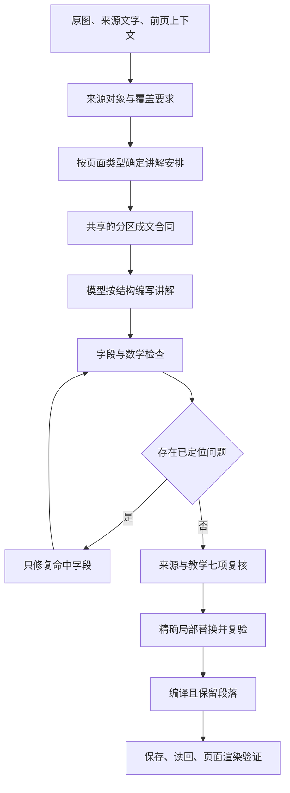

# 教学质量修复与验证方案

## 1. 已证实的问题

本轮基于代码基线 `3ebc0d7` 与远端草稿读回调查，原始课程及运行证据保存在私有运行目录

| 用户体验 | 已证实的原因 | 修复与证据 |
|---|---|---|
| 随机题显示原始公式 | 题干和选项用 React 普通文本输出，没有经过 Markdown 数学渲染 | 统一题干、选项、反馈的渲染组件，验证实际 HTML 中的 KaTeX 节点 |
| 保存后内容重新挤在一起 | 页面编译器的 `oneSentence` 抹去换行 | 编译保留 Markdown，保存读回测试比较段落和列表 |
| 单个英文词混入正文 | 英文检查器只抓部分大写缩写和多词短语 | 加入单词坏例与正确配对反例，继续保护数学、代码与原始标签 |
| 易错点挤成一长句 | 专用提示词要求四种独立作用用分号连接 | 四种作用各成段，确定性排版只识别明确标签，不猜测任意冒号 |
| 表格无法成为真正表格 | 渲染组件没有启用 Markdown 表格语法 | 增加表格解析与局部横向滚动，原行列和值不改 |
| 覆盖证据虚高 | 声称要求 12 字原文摘录，代码只找任意 5 字重合 | 要求完整证据片段存在且至少 12 字；片段存在仍不能证明语义覆盖 |
| 删除内容后看似通过 | 错误承接段被直接删除，总结超长被截断 | 保留内容进入修复，不能以信息丢失换取通过 |
| 换供应商后修复费用增加 | OpenCode Chat 协议不支持原来的字段修复路径，会重写整页 | 协议适配器直接请求指定字段，再与原对象合并 |
| 事实复核通过却仍不可读 | 复核提示词明确只核对事实，且不能修复承接、先验知识、目标 | 扩展定位范围，分别记录七项教学复核结果 |

提示词长度可能增加遗漏风险，但目前没有对照实验能够证明它是主因，不能把这一推测写成已经确定的故障原因

## 2. 生成和保存路线

每页使用固定写作策略与生成配置，保留当前 API 兼容字段

共享合同放在 `packages/quality/src/presentation.ts`，进入生成提示词，同时用于机械检查和易错点排版

模型先按独立对象和理解依赖组织内容；机械排版只处理已经明确表达的结构，不用正则表达式猜测事实、翻译名称或补齐缺失知识

七项教学复核分别检查入口、术语、前提、结构、对象、推理、题目，每项必须记录正文证据和判定；它们与来源真实性分别检查，任何一项缺失不得宣称七项全通过

## 3. 借鉴依据与边界

ReadWeave 写作运行时提供了来源单元、段落合同、覆盖矩阵、受约束成文和精确修复思路，本轮采用其可追溯分配和局部提交原则

当前安装的写作 Skill 是实际表达依据，历史运行时对术语词源、三轮阻断等要求不自动覆盖最新版 Skill

[OpenMAIC](https://github.com/THU-MAIC/OpenMAIC) 可作为教学生成与运行分离的比较对象，本轮不移植其多角色课堂，也不把该项目的存在当成本项目质量已经得到证明

[新南威尔士州教育部门的认知负荷实践指南](https://education.nsw.gov.au/about-us/education-data-and-research/cese/publications/practical-guides-for-educators/cognitive-load-theory-in-practice.html) 与[美国教育科学研究院学习指南](https://ies.ed.gov/ncee/wwc/PracticeGuide/1) 是当前 Skill 提供的教学设计依据，支持明确示范、把相关信息放在一起、连接具体和抽象表示；这些依据不证明某个模型或本次实现一定有效，效果仍需实测

## 4. 模型与费用

优先使用 OpenCode 的 DeepSeek Flash；读取原图的阶段选择已验证能接收图像的 Flash 变体

模型目录、协议及价格以[供应商当前文档](https://opencode.ai/docs/go/)和实际请求为准，不凭名称猜测视觉能力

每页分别记录模型、输入输出用量、订阅额度折算消耗、实际现金费用、重试消耗和总耗时；订阅现金边际费用为零不等于没有消耗额度

单页既有预算上限继续覆盖生成与修复，不通过增加无上限全文重试来追求评分；人民币目标需按实际结算或有日期的汇率换算，不虚报换算结果

## 5. 验证方法

1. 固定失败样本
   - 保存真实旧草稿及代码版本
   - 用合成最小对照样本覆盖未译英文、定义例外、独立问题、四段易错点和题目公式
   - 错例必须被拒绝，正确定义、代码、公式和原始表格不得因格式检查被误改
2. 检查数据经过每一层后的结果
   - 模型返回内容、编译内容、保存读回内容保持段落和公式一致
   - 所有题目选项都参与数学检查
   - 渲染后的 HTML 必须出现对应公式节点和真实表格单元格
3. 多页实测
   - 选择表格比较、公式推导、概念机制与流程图，避免围绕某一个页码写规则
   - 固定来源、语言、策略、预算与模型，记录每页独立结果
   - 先运行机械检查和七项复核，再由执行 Agent 对照原图逐页阅读
4. 判断是否改善
   - 回归测试全通过只是代码正确性的证据
   - 语义评分不代替阅读证据，也不宣称已经完成形式化数学证明
   - 任何未生成、失败或尚未阅读的样本均记为未通过，不能用平均分掩盖
   - 真实网站打开新样本时核对版本、页码与更新时间，避免一直阅读旧正式版本

## 6. 收敛标准

- 已登记机械坏例全部被拒绝，配对正确例全部通过
- 题干、选项、答案及解析中的每条公式均经过解析与渲染测试
- 编译和保存不抹去换行，不截断内容，不删除失败章节
- 七项教学复核完整且全部有证据，局部替换不改变其他字段
- 多种页面真实生成成功并完成原图对照阅读，费用与失败重试可追踪
- 远端健康、数据同步、认证和页面访问通过，源码提交与运行镜像可对应

在上述证据齐全前，只报告实际完成的项目，不宣布根治全部质量问题或绝对稳定

## 7. 首轮远端实测揭示的问题

`26f98f5` 已通过 248 项测试并上线，但首张真实页面经过备用路由后由官方 DeepSeek 返回，因此不能算作 OpenCode 样本成功

已取消该计划并保留事件，原有页面不以失败结果覆盖

- OpenCode Flash 的简单直接请求成功，约 1.9 秒返回；这只能证明基本凭据和文本请求可用，不能证明完整视觉生成质量
- 旧路由在内容错误或超时后也可能切换付费供应商，未留下充分的切换原因；后续收窄为额度或限流条件，其他失败保留原始供应商
- OpenCode 的 DeepSeek Chat 请求改为显式关闭隐藏推理，最终输出继续保留质量模式的正文预算；教学步骤仍须在可读正文里完整写出
- 字段修复提示中的旧分号排版要求同步移除，避免生成与修复阶段互相矛盾
- 第二次来源修复后的接受判断同时检查教学复核，不能只因来源核对通过而忽略表达问题

上述调整仍需新的真实多页生成结果验证，不因直接连接成功或单元测试通过就宣称质量改善成立

## 8. 分字段修复与正文片段绑定

第二轮四页均未通过，保留失败状态，不计为交付完成

独立对照中，同时重写多个字段后，模型仍会拼接不存在于正文的覆盖摘录；将正文定稿与摘录分开后，该类定位错误消失

当前实现调整为：

1. 每次只修复一个内容字段，传入该字段的成文规则，保留其他字段
2. 先完成正文、定义、题目等内容，再建立覆盖证据
3. 程序从定稿正文提取候选片段，模型只选择片段编号，程序绑定实际文字；不存在的编号拒绝，不用模糊相似度代替真实摘录
4. 修复费用逐次累计，后续请求使用剩余预算；会话编号在同一页面任务内保持稳定，请求幂等键仍各自独立
5. 原文引句可能以数字开头，带中文解释的真实引句不应因这个形式差异误判；普通英文和题库选项仍参与检查

片段能够定位只证明文字存在，不证明它解释了对应来源对象，因此来源复核和逐页原图对照仍须分别进行

## 9. 复核上下文与误判修复

第三轮首张页面的机械检查已通过，但语义复核失败，实际估算消耗为 0.038797 美元；后续批次已取消，不能算作成功生成

查到的具体差异如下：

- 生成请求有前页上下文，复核请求漏传了该字段，导致承接段被误判为无来源
- 复核器没有收到实际写作规则与共享成文合同，无法一致地区分首次专业定义与后续中文表达；首次专业定义仍应按规则配英文，不能把全部双语问题当作误报
- 必要通用定义被当作课件原文主张核对，复核修正可能把有用解释删成“页面未提供”
- 原图中的可计算等式以及定义的物理量仍可能被漏检，机械检查不能替代实际核算

修复将前页来源、实际写作规则和成文合同传入同一复核请求，明确区分原图事实、前页事实、通用背景、可验证推导与自拟例子；通过具体定义、单位、运算与成立条件判断，不能只根据是否逐字出现在原图里决定对错

回归测试直接检查供应商收到的请求，防止仅在计划中声明“已传上下文”而实现仍然遗漏；真实同页复核还必须验证误判减少且能够指出原先漏掉的事实错误

## 10. 分开核验事实与教学表达

同稿对照发现，把来源、计算、定义、全部写作规则和七项教学复核塞入一次请求，会遗漏实际数值错误。单独事实核验约 9.8 秒返回，输入约 6961 token，能够发现原先漏掉的阶乘等式错误；该样本仍漏检了一个定义问题，不能把一次改善当作全量证明

高、低强度思考实验分别耗尽两次 8000 与 12000 token 输出额度，未得到可用核验结果；这些试验不作为默认配置上线，费用计入研发试验

当前流水线把事实核验与教学表达核验分别调用，仍使用同一 OpenCode Flash 路由并累计同一页预算：

- `source-audit-prompt.md` 只核对来源、定义、数值、条件及跨字段一致性
- `teaching-audit-prompt.md` 结合实际写作规则，核对入口、定义表达、段落、对象解释、推导可读性及题目
- 一个核验通过不能覆盖另一个核验的失败，分别保留证据
- 补丁字段限定为本页真实存在的路径，不接受模型自造字段
- 正文中的精确事实片段被修改时，包含同一片段的覆盖摘录在同一事务中同步替换；不把无关摘录改绑到整段正文

上述改变仍以真实四类页面生成、原图对照及页面渲染作为验收，不能只依赖模型自评

## 11. 修复事务顺序与费用记录

分开核验后仍发现两个执行缺口：写作核验看到的还是事实修正前的稿子，可能提出互相冲突的补丁；后续请求失败时，成本记录遗漏了此前成功的调用。第四轮四页均失败，不能只凭日志中较低的失败费用宣称预算达标

当前修复采用以下顺序：

1. 核验事实并执行可精确定位的最小补丁
2. 写作核验读取事实修正后的内容
3. 合并补丁后重新检查内容与覆盖引用
4. 每次模型调用独立保留用量回执，后续失败或用户取消不会抹去已发生的用量
5. 取消只阻止草稿写入和任务继续运行，已经收到的计费回执仍需幂等记账；网络中断且未收到用量的请求仍无法凭空补齐账单

OpenCode 的当前文档区分工作日 UTC 01–04、06–10 高峰时段与其他非高峰时段。价格估算按该时间表选择，并在快照 ID 中记录价格时段；显式自定义价目表不自动折扣。价格窗口边界与周末均使用固定时间测试，不能长期拿高峰价当当前实际估算，也不能在进入高峰后继续沿用低价

单页上限仍为 0.06 美元，不增加预算换取通过；订阅额度估算与实际现金费用继续分开记录。已取消旧试验的缺失用量不伪造补写，保留对账缺口

## 12. 校准复核结论与实际正文的关系

第五轮四页仍未通过，估算费用依次为 0.042128、0.018147、0.022406、0.019762 美元，未发布这些失败稿

读取完整草稿与事件后发现，复核器把易错点中用于反驳的观点当作作者结论，也把选择题干扰项当作知识错误；部分“字段被截断”的判断与保存的完整字符串不符。这类复核错误会驱动后续修复改动原来正确的内容

本轮增加以下约束：

1. 每条事实复核必须绑定真实字段与其中的连续原文，不存在的引句作为复核错误处理，不能算成课程内容错误
2. 易错点结合错误观点、错因与正确判断整项核对，选择题结合题干、选项、正确答案与解析核对
3. 原样保留的错误公式结合其后独立核算与限制说明核对，不能孤立截取等式判定
4. 局部补丁在进入后续处理前，先验证原文确实存在；失败保留费用与错误，不修改稿件

同稿事实复核对照约 10.7 秒返回，输入 8758 token、输出 2156 token，原先两项易错点误判与干扰项误判未再出现。但其数值修正仍使用不够准确的数量级近似，因此这次对照只证明定位和上下文判断有所改善，不证明补丁已经正确或整个框架达到交付标准

移动端实测还发现，390 像素视口中学习网格内部被内容撑到约 613 像素，外层裁切掩盖了问题。修复把网格列限制到可用宽度，标题与工具栏按需换行；验证时同时测量内部区域和按钮位置，不只检查页面是否出现横向滚动条

## 13. 让局部修复收到实际问题位置

同轮另一张页面已经写明“只有在权重为正且其他项不变时”才成立的变化方向，却仍被条件检查器拒绝。原因是检查器只识别部分条件句式，没有识别“只有在”；易错点中的被反驳观点也可能被它单独检查

修复保留实际错误的检查，同时接受这些等价条件句式，并区分被反驳观点与正确判断。正反例验证既要求正确条件句通过，也要求错误的“正确判断”继续被检出

局部修复请求增加真实字段、问题原句和中文修改要求。重复标题指出全部重复位置，并要求按实际公式或对象区分标题；未翻译英文逐行定位到易错点、题干、选项、标准答案或解析，不能只给正文检查而漏掉题库。代码与数学符号不作为普通英文处理

这些改变减少的是误判与无效修复，仍需重新生成及逐页阅读才能判断成文质量；不会把既有失败记录改写成成功

## 14. 修复审计版本错位与无效页码说明

`15b1890` 的四页候选试生成仍全部失败，费用依次为 0.020755、0.033423、0.015104、0.021746 美元，未发布这些草稿

事件与草稿对照确认了三个执行缺口：

1. 写作审计给出补丁后，任务仍使用修复前的 teachingChecks 判定修复后的内容，形成必然失败的旧结论
2. 路由层先在一个内容版本上核验补丁，调用层随后在另一个版本上重新播放多条补丁；同一字段的修复发生重叠时会失去精确位置
3. 页码说明已被机械规则识别，但连续两次模型修复仍保留原句，说明确定性可删除的界面旁白不应交给模型反复决定

当前改为：

- 路由层在被审计的精确版本上执行最小补丁，并把修复后的完整 TeachingPackage 交给调用层
- 只有补丁存在时才单独复核修复后的教学表达；修复前的 verdict 只作为历史证据，不再直接判定新版本
- 补丁位置无效时在剩余单页预算内进行一次精确重试，仍无效则失败，不放宽事实检查
- sourceChecks 的 quote 只允许 Markdown、引号和空白等表示差异，不能用语义相近的改写冒充原文定位
- 页码、页脚和版式说明在内容规范化阶段确定性删除，保留前后真实教学段落

这批修复已有回归测试，但真实多页生成和浏览器阅读尚未完成，因此本节不把框架记为通过

## 15. 负面教学结论也必须绑定正文

`5f2d1c5` 上线后的候选实测中，第 7 页通过并保存为 ready，估算费用 0.013026 美元；第 4 页失败，估算费用 0.034567 美元；发现评估问题后取消后续批次，第 12 页在取消生效前已发生 0.016613 美元估算用量，第 16 页没有启动

第 4 页保存的完整讲解只有一段表格阅读说明，教学审计却声称该段连续重复两次。该结论没有绑定字段和原文位置，无法由实际草稿复现，属于评估误判

当前规则扩展为：

- teachingChecks 的 contradicted 与 unverified 必须提供实际 field 和该字段中的连续 quote
- 程序核对 quote 确实存在后才接受负面判定；只允许 Markdown、引号与空白的表示差异，不接受改写
- 无法定位的负面结论在单页预算内重试一次，仍无法定位则记为审计输出无效，不能驱动正文修复
- supported 仍须提供具体 evidence，但不强制用一个短引句冒充整个项目已经被证明

这项约束只消除无法定位的误判，不替代原图事实核对，也不把第 7 页一次成功外推为全量课程已经达标

## 16. 把机械通过后的人工失败变成回归规则

`9f81c9a` 上线后，第 4 页候选任务完成并保存为 ready，估算费用为 0.051644 美元；来源核验、教学核验、数学、结构与 ReadWeave 读回均通过，但逐段阅读仍发现三个系统性缺口，因此该结果不作为最终质量样例

- 正文把“多个目标相互竞争”扩大成“没有唯一最优解”，也用“每一代为什么不够用”概括方法演进；现有证据只能支持需要权衡及材料列出的局限，不能支持这些绝对结论
- `功耗（power）`、`时序（timing）` 等小写英文括注被旧英文检查器当成合格双语，实际不符合正式英文名称与后续优先使用中文的规则
- 完整讲解反复用“页面给出”“本页列出”“表中写着”组织段落，虽然没有逐字重复，仍让正文读起来像来源审计记录

当前改为：

1. 中文括号中的英文只有在按正式名称大小写书写时才算完成配对，小写词典式注释继续作为未配对英文处理
2. 完整讲解中过量来源旁白触发独立失败码，修复只改变叙述视角，不删除对象、数字、公式、条件与必要边界
3. “不存在唯一最优解”“每一种方法都不够用”等绝对结论触发论证强度检查；多个竞争目标只允许推出需要权衡，除非材料另有目标函数、权重、约束或比较证据
4. 来源核验与教学核验同时检查结论强度；修复字段精确定位到实际正文，并同步维护覆盖摘录
5. 写作策略重新核对公开仓库 `main@43133c20eabd0edde5ff8effa8d8a51c7ee8afa3`，当前快照恢复为 `writing-policy:1596555b73a37e62`，不再把 9 月 13 日的本地安装改版宣称为公开最新版

这些规则必须在表格页、公式页、概念页和流程页的多页试生成中共同通过，并由执行 Agent 阅读实际成稿后才能进入正式发布

## 17. 第一次最新版策略多页试验

`5ac412d` 与 Harness 2.4.37 上线后，以同一策略、模型和单页 0.06 美元上限生成第 4、7、12、16 页

- 第 4 页因来源旁白过多失败，费用 0.021587 美元；两轮修复都收到失败码，却没有收到命中的六行正文，因此无法可靠收敛
- 第 7 页被系统保存为 ready，费用 0.013032 美元；人工复读发现学习目标声称另一参数不变，而正文正确算出两个参数同时变化，同时承上启下内容在完整讲解开头重复，证明原有完成状态仍然漏检跨字段矛盾与跨区块重复
- 第 12 页因题目中的带权趋势缺少权重符号及其他输入固定条件失败，费用 0.013086 美元；两轮修复没有收到具体题号和原句，未能收敛
- 第 16 页在新缺口确认后取消，费用为 0；计划总费用 0.047705 美元，正式 release 未修改

当前执行修正包括：

1. 来源旁白失败向修复器提供每一条实际命中行，并要求全字段最多保留五条必要来源说明
2. 带权趋势失败定位到具体题号与解析原句，题干、答案和解析同步补齐权重符号及其他输入固定条件
3. 学习目标新增“另一参数保持不变”与正文“多个参数同时改变”的跨字段矛盾检查
4. 承上启下非空时，完整讲解开头再次复述前页触发失败；“页面上的对象”等审计式标题单独触发失败
5. 后续多页试验必须使用新的 Harness 2.4.38，不能把本轮第 7 页的旧 ready 状态混入新计划
